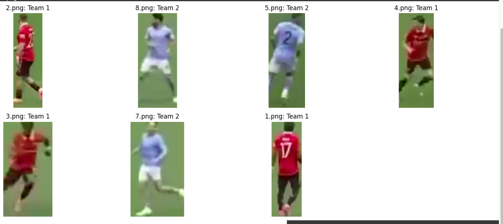

# sports-team-jersey-classifier

This repository contains code for classifying player jerseys into two teams based on their color. The classification is achieved using unsupervised learning techniques, specifically K-Means clustering. The code processes images, extracts color features, applies K-Means clustering, and displays the results along with the predicted team labels.

## Features
- Utilizes K-Means clustering for unsupervised learning.
- Extracts color features from jersey images.
- Displays classification results with predicted team labels.
- Supports visualization of clustering results using PCA.

## Usage
1. Clone the repository.
2. Place jersey images in the designated directory or use the sample images provided in the repository.
3. Run the provided code cells in this notebook to classify jersey colors.
